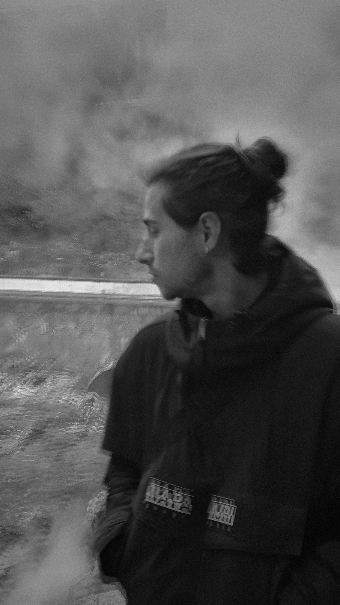

	

		
Hi! I'm Juan Antonio (also known as Juanan or Juan).

		 
		
I'm <b>Full-Stack Developer</b> and I like to add value both in multidisciplinary teams and individual developing.

		 
		
Actually I work in Seville as <b>Senior Developer</b> at <a href="htstps://www.lynxspa.com/" target="_blank">Lynx</a>.

		 
		
I like to learn and create new projects, this is why I have created this site, to share my experience about learnings, ideas and useful documentation for me among other things.

		 
		
I made this project under a personal brand (stunnin'.dev), because one of my hobbies is design.

		 
		
This blog was built with <a href="https://www.gatsbyjs.com/" target="_blank">Gatsby</a> and it was an adventure for me to develop it while I was learning about <a href="https://reactjs.org/" target="_blank">React</a>, <a href="https://graphql.org/" target="_blank">GraphQL</a>, <a href="https://www.typescriptlang.org/" target="_blank">TypeScript</a> and many other technologies in the process.

	

	

		
	

 

	 

I would invite you to take a look at [this post](/sobre-este-proyecto) to know more about the arquitecture of this project.

 

If you want to know about my experience in detail, CV or asking anything, you can find me in:

 

- \- [hello [at] stunnin [dot] dev](mailto:hello@stunnin.dev)
- \- [GitHub [@jsm94]](https://github.com/jsm94)
- \- [Twitter [@stunnindev]](https://twitter.com/stunnindev)
- \- [LinkedIn](https://www.linkedin.com/in/juan-antonio-seco-merch%C3%A1n/)