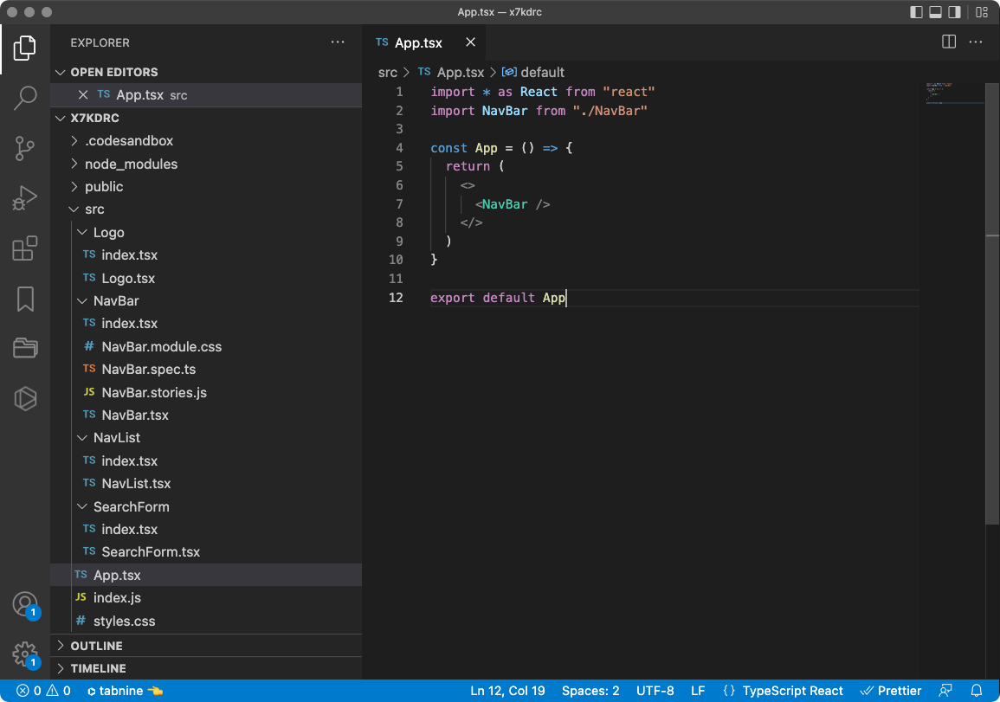
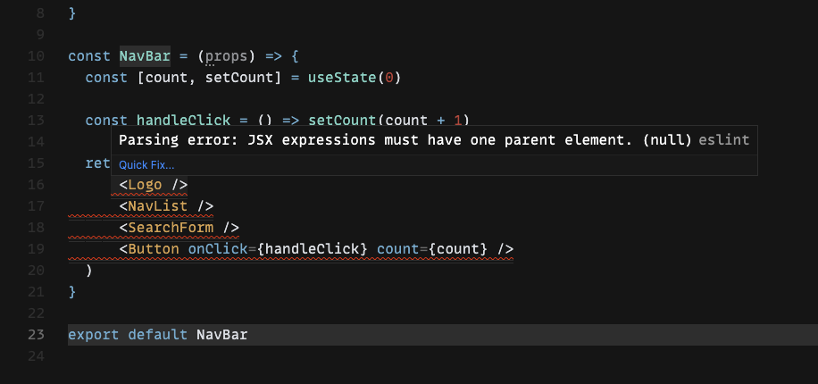

Cuando aprendes **React** de forma autodidacta puedes encontrarte con muchas dudas a la hora de cómo organizar tu código o incluso cómo declarar las funciones.
Esto es porque React (o más bien JavaScript) es tan flexible que te permite abordar el mismo problema de muchísimas formas, pero a veces puede que la forma en la que se nos ocurre no sea precisamente la más adecuada.

En este post compartiré **cinco consejos** que me ayudaron en el proceso de aprendizaje y que nos hace el desarrollo con React mucho más satisfactorio.

### Megacomponentes

Muchas veces podemos pecar de crear componentes muy grandes o complejos, por lo que perderemos gran parte de reusabilidad, refactorización y simplicidad a la hora de testing.

Por ello la mejor opción es modularizar lo máximo posible nuestros componentes y simplificarlos de tal manera que podamos aprovechar su estructura para principios [SOLID](https://es.wikipedia.org/wiki/SOLID).

Aunque es un caso muy simple podemos ver un ejemplo de refactorización con el siguiente código.

``` tsx
const NavBar = (props) => {
  return (
    <div className="nav">
      <div className="logo">Logo</div>
      <ul>
        <li>
          <a href="/" className="nav-link">
            Home
          </a>
        </li>
        <li>
          <a href="/contact" className="nav-link">
            Contact Us
          </a>
        </li>
      </ul>
      <form className="search-form">
        <input
          className="search-input"
          type="search"
          placeholder="Search"
          aria-label="Search"
        />
        <button className="search-button" type="submit">
          Search
        </button>
      </form>
    </div>
  )
}

export default NavBar
```

El código representa una barra de navegación la cual podemos separar en tres componentes principales: *Logo*, *Lista* y *Formulario de Búsqueda*

Ahora vamos a refactorizar cada uno de ellos en un componente.

``` tsx {1-3,7-11}
import Logo from "./Logo";
import NavList from "./NavList";
import SearchForm from "./SearchForm";

const NavBar = (props) => {
  return (
    <>
      <Logo />
      <NavList />
      <SearchForm />
    </>
  )
}

export default NavBar
```
Mucho mejor, ¿verdad?

### Estructura

No es raro al ir desarrollando con React ir creando componentes esparcidos en el proyecto sin organización ninguna, pero a la larga, a medida que crece tu proyecto, puedes encontrarte en medio de algo bastante caótico.

Una de las prácticas que más se siguen en React para medianos o grandes proyectos es organizar los componentes por carpetas.

Esto nos permite organizar en una misma carpeta un componente, con sus estilos, testing, documentación, etc.



Si nos fijamos en las carpetas de los componentes, por ejemplo del componente **NavBar**, podemos ver que tiene un archivo `index.tsx` y un archivo `NavBar.tsx`.

En el archivo `index.tsx` podemos alojar todo nuestro componente para importarlo luego desde la ruta `./NavBar`, el problema de esto es que en nuestro editor tendremos muchas pestañas `index.tsx`, lo cual nos va a provocar mucha confusión al buscar entre nuestros componentes.

Una solución a esto es crear un archivo con el nombre del componente, como puede ser `NavBar.tsx`, para que contenga toda la lógica del mismo.

Luego en `index.tsx` exportamos este componente para poder importarlo de la misma forma que siempre con la ruta `./NavBar`, si no tenemos este archivo index tendríamos que importarlo con la ruta `./NavBar/NavBar`, menos elegante para mi gusto.

```tsx:title=src/NavBar/NavBar.tsx
import * as React from "react"
import { useState } from "react"
import Logo from "../Logo"
import NavList from "../NavList"
import SearchForm from "../SearchForm"

const Button = ({ onClick, count }, {}) => {
  return <button onClick={onClick}>counter {count}</button>
}

const NavBar = (props) => {
  const [count, setCount] = useState(0)

  const handleClick = () => setCount(count + 1)

  return (
    <>
      <Logo />
      <NavList />
      <SearchForm />
      <Button onClick={handleClick} count={count} />
    </>
  )
}

export default NavBar
```

```tsx:title=src/NavBar/index.tsx
export { default } from "./NavBar"
```

### Rendimiento

Sin pretenderlo, podemos encontrarnos con un **fallo de optimización** bastante común, como puede ser renderizar un componente hijo cada vez que su padre se actualiza a través de una función.

Esto puede provocar problemas de rendimiento y comportamientos impredecibles en nuestras aplicaciones.

Podemos ver la comparación con los siguientes ejemplos.

``` tsx {1,7-13,20}
import { useState } from "react"
import Logo from "./Logo"
import NavList from "./NavList"
import SearchForm from "./SearchForm"

const NavBar = (props) => {
  const [count, setCount] = useState(0)

  const handleClick = () => setCount(count + 1)

  const Button = () => {
    return <button onClick={handleClick}>counter {count}</button>
  }

  return (
    <>
      <Logo />
      <NavList />
      <SearchForm />
      <Button />
    </>
  )
}

export default NavBar
```

Una forma de solventarlo es apartando este componente hijo y pasar como propiedad la función.

``` tsx {6-8,20}
import { useState } from "react"
import Logo from "./Logo"
import NavList from "./NavList"
import SearchForm from "./SearchForm"

const Button = ({ onClick, count }) => {
  return <button onClick={onClick}>counter {count}</button>
}

const NavBar = (props) => {
  const [count, setCount] = useState(0)

  const handleClick = () => setCount(count + 1)

  return (
    <>
      <Logo />
      <NavList />
      <SearchForm />
      <Button onClick={handleClick} count={count} />
    </>
  )
}

export default NavBar
```

¡Listo! Con este truco tendremos aplicaciones mucho más eficientes.

### Demasiados *divs*

Seguramente te hayas topado con este error desarrollando en React:



Y es que para renderizar un componente, este debe de estar contenido en un sólo padre.

De forma intuitiva plantamos un `<div>...</div>` y listo, pero con esto tendríamos en nuestro proyecto muchos *divs* innecesarios, lo que puede provocar problemas de accesibilidad y en estilos CSS.

Para solucionar esto podemos hacer uso del componente `<React.Fragment>...</React.Fragment>` o `<>...</>`.

``` tsx {2,7}
  return (
    <>
      <Logo />
      <NavList />
      <SearchForm />
      <Button onClick={handleClick} count={count} />
    </>
  )
```

### Spread Props

Otro truco de React es la **propagación de propiedades** o **spread props**, que sería la alternativa a tener que escribir todas las propiedades de un componente uno a uno (que cuando son muchas hace daño a la vista).

Esto sólo puede hacerse cuando el objeto que estamos pasando como parámetro tiene las mismas propiedades que el componente.

Como siempre, usaremos ejemplos muy simples con sólamente dos propiedades, pero podemos usar la imaginación y extrapolarlo a un componente con cincuenta.

Supongamos que en nuestro Logo queremos parametrizar un título y un eslogan. En este ejemplo podríamos ver una asignación de propiedades tradicional.

``` tsx {1-4,8}
  const LogoData = {
    title: "Title",
    slogan: "slogan"
  }

  return (
    <>
      <Logo title={LogoData.title} slogan={LogoData.slogan}/>
      <NavList />
      <SearchForm />
      <Button onClick={handleClick} count={count} />
    </>
  )
```

Ahora veremos la alternativa con **spread props**.

``` tsx {8}
  const LogoData = {
    title: "Title",
    slogan: "slogan"
  }

  return (
    <>
      <Logo {...LogoData}/>
      <NavList />
      <SearchForm />
      <Button onClick={handleClick} count={count} />
    </>
  )
```
Imaginaros lo que nos ahorra esto para componentes con muchas propiedades.

Lo que sí es recomendable no abusar de esta técnica, ya que al no tener las propiedades epxlícitamente, podemos encontrarnos con problemas a la hora de revisar nuestro código. Por ello, mejor usarla sólo cuando la cantidad de propiedades justifique su uso.

### Fin

Con esto terminamos los cinco consejos que a toda persona que comienza con React le vendrá de perlas.

Existen muchas utilidades y soluciones además de las mencionadas, pero algunas requieren un conocimiento más avanzado y explicaciones más densas. Probablemente escribiré en un futuro sobre ellas.

🖖🏽

Foto de portada de [Simone Hutsch](https://unsplash.com/es/@heysupersimi) en [Unsplash](https://unsplash.com/)
