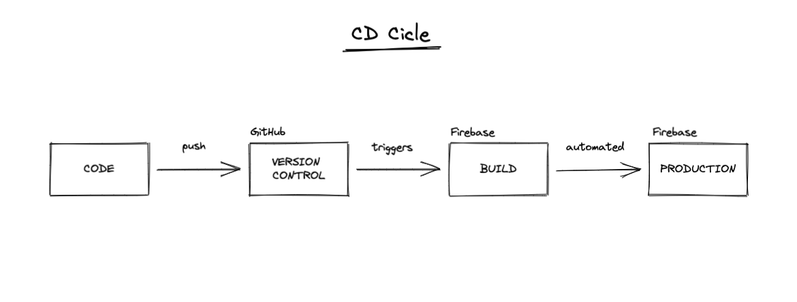
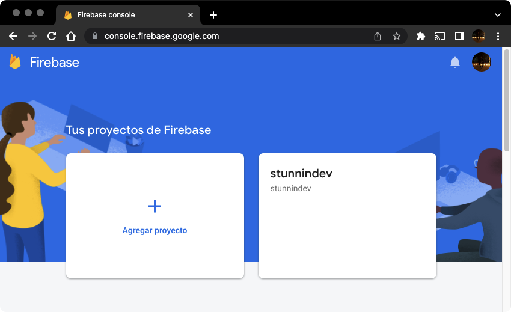
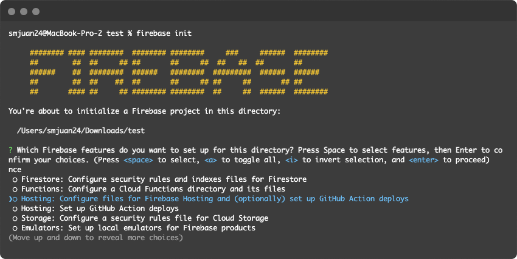
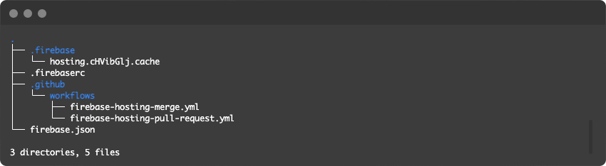
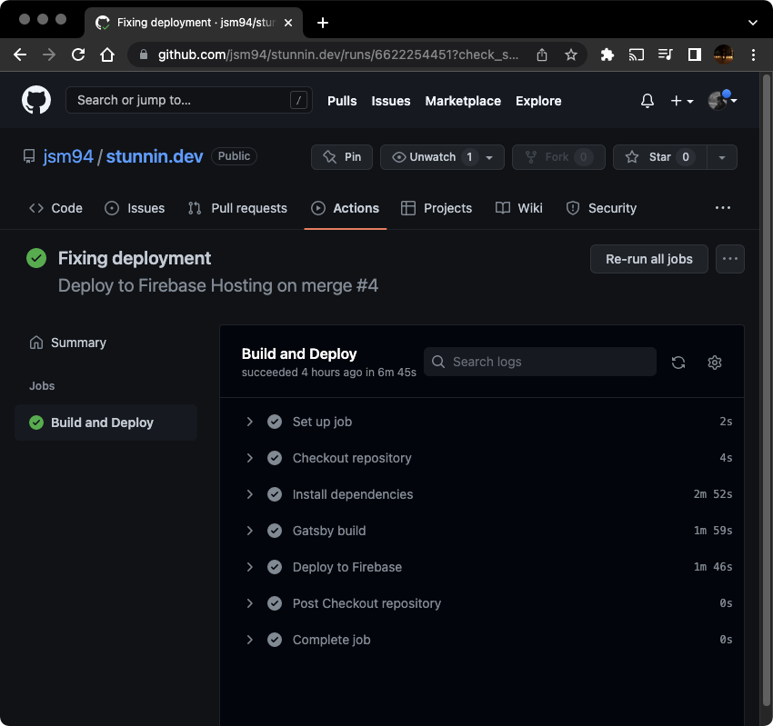

Es cierto que para un proyecto de este tipo tampoco sería muy tedioso ejecutar un simple `gatsby build` y tras esperar unos minutos hacer un `firebase deploy`.

Pero a medida que crezca el número de artículos posiblemente se tome más tiempo en completar el `build`, por esto nos viene muy bien seguir una estrategia de CD (Continuous Deployment) para poder automatizar este proceso.

En este caso es bastante simple, ya que por la arquitectura actual del proyecto no era necesario implementar CI (Continuous Integration). Por lo que el ciclo de CD quedaría de la siguiente forma.



### ¿Cómo configuramos esto?

Si bien en este artículo no se explicará en detalle el proceso de configuración e integración de este sistema, sí quiero señalar a simple vista qué elementos intervienen en este proceso y mostrar lo sencillo que fué para este proyecto.
En un futuro elaboraré un tutorial bajo un mini-proyecto para explicar la configuración paso a paso.

Lo primero es tener una cuenta de **Google** para poder realizar `login` en la plataforma de Firebase.



Después de esto, si pulsamos en `Agregar proyecto`, seguimos el asistente y podremos crear un nuevo proyecto o elegir uno existente que tengamos en **Google Cloud**.

Una vez configurado el proyecto podemos vincularlo con la librería `firebase-tools` que agregaremos a nuestro proyecto local.

``` noLineNumbers
npm install -g firebase-tools
```

Luego deberemos de autenticarnos en Google Cloud a través del CLI de Firebase.

``` noLineNumbers
firebase login
```

Tras realizar la autenticación podremos inicializar Firebase.

``` noLineNumbers
firebase init
```
Nos aparecerá un asistente de configuración bastante intuitivo.



Para este caso escogimos la opción de **"Hosting: ... GitHub Action deploys"**.

Esto nos establece toda la configuración necesaria para su despliegue en el hosting de Firebase y además nos configura
un **workflow** para **GitHub** el cual nos despliega de forma automática el proyecto cuando hagamos un `push` con la rama que tengamos configurada.

Al terminar todos los pasos anteriores tendremos en nuestro proyecto los siguientes nuevos recursos referentes a Firebase.



Importante añadir a nuestro `.gitignore` la carpeta `.firebase`.

Si nos fijamos en la carpeta `.github/workflows`, contiene una serie de ficheros que serán los que interprete GitHub para ejecutar GitHub Actions.

He tenido que hacer una serie de ajustes al fichero [firebase-hosting-merge.yml](https://github.com/jsm94/stunnin.dev/blob/master/.github/workflows/firebase-hosting-merge.yml) que te crea por defecto para la acción `push`, como por ejemplo añadir un paso para la instalación de las dependencias.

También es importante configurar los ajustes de caché en el fichero [firebase.json](https://github.com/jsm94/stunnin.dev/blob/master/firebase.json) tal y como se aconseja en la [documentación oficial de Gatsby](https://www.gatsbyjs.com/docs/how-to/previews-deploys-hosting/deploying-to-firebase/).

Con todo esto configurado sólo tengo hacer `push` y se estarán desplegando automáticamente los cambios a producción.



🚀

Foto de portada de [Thomas Drouault](https://unsplash.com/es/@thomasdrouaultphotography) en [Unsplash](https://unsplash.com/)
