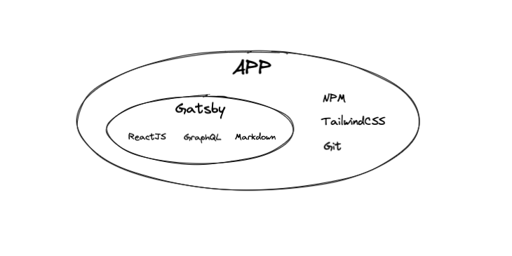

Tras muchos intentos fallidos, por fin he podido dedicar el tiempo suficiente como para poder construir este blog.

Sí, lo intenté varias veces, pero había varios problemas. Entre ellos, la universidad, que consumía mucho tiempo, falta de inspiración, no aplicarle disciplina...

Pero al fin, gracias a la motivación por aprender nuevas tecnologías se alinearon los planetas y he podido encontrar las herramientas adecuadas y realizar este proyecto en poco más de un mes.

#### ¿Qué es este proyecto?

Bueno, realmente no es gran cosa, ya que es un simple blog. Pero aquí recogeré todo el aprendizaje que me parezca interesante y pueda ayudarle a quién le llegue la información.

También será una guía para mí, por si necesito volver a echarle un vistazo a aquella configuración que hice que siempre se me olvida. Un manual sobre los proyectos que he llevado a cabo, para reflejar la experiencia en el proceso.

#### ¿Cómo está construido?

Por simplificación, podríamos dividir su estructura en dos bloques principales, **aplicación** y **despliegue**.

##### Aplicación

Visión general:

- **Gatsby** - Generador de contenidos estáticos
- **ReactJS** - Librería JavaScript para crear interfaces a través de componentes reutilizables
- **GraphQL** - Lenguaje de consultas y manipulación de datos
- **Markdown** - Lenguaje de marcado para crear las páginas y posts
- **NPM** - Gestor de paquetes JavaScript
- **TailwindCSS** - Framework CSS para facilitar la creación de nuestros componentes
- **Git** - Para nuestro control de versiones

La tecnología principal de este blog es [Gatsby](https://www.gatsbyjs.com/docs). Sin entrar en muchos detalles, es un **generador de contenido estático** para tu contenido dinámico, esto es fantástico para un blog, ya que no se necesita de una alta complejidad estructural ni backend y te permite centrarte en el diseño y contenido del mismo.

**Gatsby** se encarga por sí sólo de optimizar las imágenes, comprimir archivos, hojas de estilos y generarte todo el contenido estático listo para su despliegue en cualquier hosting básico, ya que el resultado final sólo es *HTML*, *CSS* y *JavaScript*, además de asegurarte tener un sitio web con una **velocidad de carga mínima**.

Gracias a esto, alojar este proyecto me cuesta... **!0 euros!** (excepto el dominio, pero incluso se podría prescindir de él). En el apartado de despliegue doy más detalle de esto.

Para desarrollar con **Gatsby** es necesario tener conocimiento al menos de **JavaScript**, para aprender en el proceso a usar [ReactJS](https://es.reactjs.org/docs/getting-started.html), que es la librería de la que haremos uso para estructurar nuestro proyecto a través de **componentes**.

[GraphQL](https://graphql.org/learn/) es el encargado de recoger la información necesaria para mostrar nuestro contenido de los posts en nuestro blog, haciendo una consulta sobre nuestros ficheros y manipulando los datos a nuestro antojo. **GraphQL** es muy versátil ya que podemos conectarlo a cualquier API para recoger información.

En nuestro caso **GraphQL** lee de nuestros post o páginas escritos en [Markdown](https://markdown.es/), recoge información de la aplicación, como por ejemplo `variables` que tengamos en ficheros de configuración, etc.

Luego con [Tailwind CSS](https://tailwindcss.com/) nos apoyamos con sus clases predefinidas para construir **interfaces** junto con nuestros componentes de **ReactJS**, con esto conseguimos modularizar al máximo nuestros componentes y obtener un código mínimo, limpio y muy reusable [(DRY)](https://en.wikipedia.org/wiki/Don%27t_repeat_yourself).

Con [NPM](https://docs.npmjs.com/) gestionamos nuestros paquetes necesarios para nuestro entorno de desarrollo, Gatsby, además de sus plugins, tests, CI/CD...

Y por último [Git](https://git-scm.com/), para gestionar el versionado de nuestro software y ya de paso [hacerlo público en GitHub](https://github.com/jsm94/stunnin.dev), para quién quiera curiosear el código o corregir cualquier cosa.

##### Despliegue

Para el despliegue uso [Firebase](https://firebase.google.com/?hl=es), con el paquete [firebase-tools](https://www.npmjs.com/package/firebase-tools), es muy fácil de configurar con su CLI y se realiza en pocos pasos.

**Firebase** forma parte del ecosistema de Google por lo que nuestro [Firebase Hosting](https://firebase.google.com/products/hosting?gclid=Cj0KCQjwyYKUBhDJARIsAMj9lkE3QhAnph8Tui6xWdJ5dsSy7PuEbzgsnOYk0ABJz9kf6arx554DVk0aArbeEALw_wcB&gclsrc=aw.ds) estará relacionado con un proyecto de **GCP (Google Cloud Platform)**, por ello es necesario crear un proyecto aquí y tener activada la facturación, aunque como ya dije anteriormente, **no tendrá ningún coste**.
Esto es porque hacemos uso del [Plan Spark](https://firebase.google.com/pricing) que con sus límites nos serán más que suficientes para mantener el proyecto sin coste.

En **Firebase** ya te proporcionan un **dominio** propio del tipo [nombre-proyecto].web.app bajo **SSL**, pero siempre puedes configurarlo bajo tu dominio.

Otras de las bondades de **Firebase** es su integración con **GitHub**, por lo que en el caso de que hagamos un `merge` con nuestra rama principal, él solito nos hará `build` de nuestro proyecto y `deploy` en nuestro hosting.
Sólo tengo que centrarme en escribir un post y hacer `push`.

🧘🏽‍♂️

Foto de portada de [jake grella](https://unsplash.com/es/@jakegrella) en [Unsplash](https://unsplash.com/)
